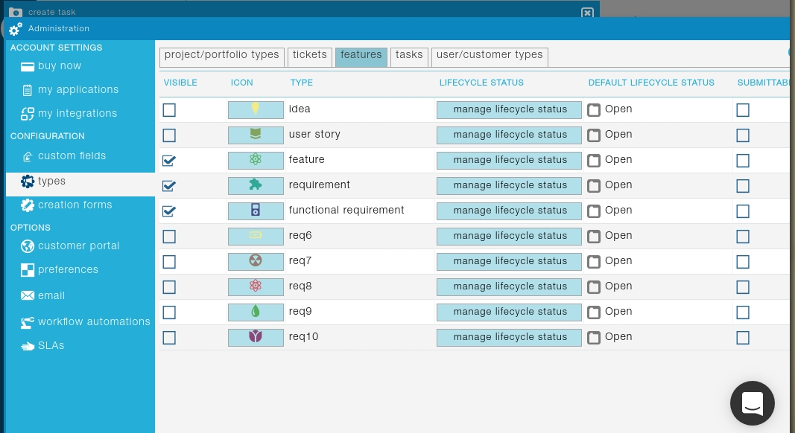
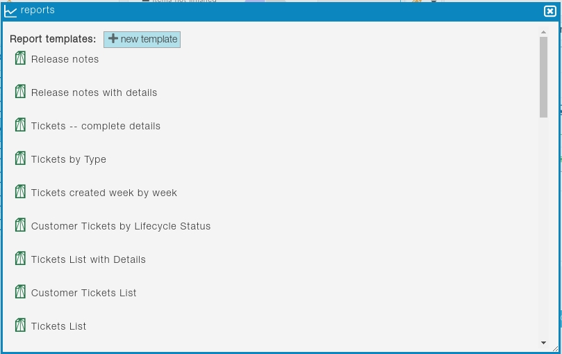

## characteristics

### Специфициране на изисквания
Onedesk осигурява портал за customer-driven разработка, като за специфициране на изисквания исползват се онлай-чатове, issue-tracking.
Onedesk дава възможност клиенти да предлагат свои идеи, въпроси, feedback за компания-изпълнител, и да дискутират с представители на екипа и други потребители. Като изпълнител има възможност да организират анкети, а след това да всички получени данни да се генерират в изисквания или users-stories с един клик и да ги анализарат относно различни метрики. 

- Типове изисквания

Разрешено е да дефинираме своите типове на item-и, както и различни типове и под-типове на изисквания, например функционални такива.

### Организация и съхранение на изисквания
Генерирани автоматично от дисскуссии с потребители и клиенти изисквания могат да бъдат трансформирани до таскове(задачи)

Позволява да анализира изисквания относно бизнес цели, популарността, ROI и др.
### Колаборативна работа
- Роли на екипа

Екипа има възможност като да исползва pre-defined роли, така и да създава нови роли с различни ограничения за хора от екипа така и за ползватели.
Например въможно е да разрешим на определени ЗИ да гласуват за фидбеки, обаче да нямат възможност да ги коментират.

- Контрол на версиите

Система води цялата история на изисквания, където вижда се как, защо, когда и къде тези изисквания са били променени

Свързване на изисквания с всеки релизи

Пренасяне на неизпълнени изисквания за бъдещи релизи.

Интеграция с TFS (Team Foundation Server) която дава възможност за приватен контрол на версии.

### Проследяемост на изисквания
https://www.onedesk.com/features/requirements-prioritization/

Приотеризация на изисквания исползвайки различни метрики.

Auto-generated roadmaps;

- Свързани изисквания (модели)

не съм сигурен какво значи тази точка

Всяко изискване може да бъде свързано с всеки item в системата, например свързване на таскове, изисквания и публична дискусия.

### Интеграция със среди за моделиране на изисквания (UML)
Няма такава интеграция
### Интеграция със среди за разработка (IDEs)

Zapier.com расширение за Visual Studio, което автоматично добавя данни от Onedesk в VisualStudio, като и за експортиране на таскове като ивенти в Office 365 calendar. 

[повече за VS интеграция](https://zapier.com/apps/onedesk/integrations/visual-studio-online/16017/new-work-item-in-onedesk-creates-new-work-item-in-visual-studio)

### Интеграция със среди за тестване
Всички файлове създадени с Microsoft Project са съвместими с oneDesk. ??

Salesforce, Zendesk, Jira, TFS, SAML. -  от това само Microsoft Project е за тестване малко

### Поддържани стандарти
Onedesk има публично API, което позволява на разработчици да достъпват функционалност на система чрез код, което е полезно при автоматизация на вътрешни процесси по време на разработка на проекта.

SSO (Single Sign-On) исползвайки OAUTH2, което премахва нужда от управление на никнейми и пароли. Една от тях е google SSO

### Генериране на отчети (Reporting)
Onedesk поддържа шаблони за отчети, които могат да бъдат експортирани като `pdf` или `xslx`. Възможно е да дефинираме нови шаблони, но има и предефенирани:

Всеки потребител и служащ в компания-изпълнител имат достъп до портал където са отобразени текущ статус на проекта, 

Освен това има и RoadMap на промени в изисквания

### Лиценз, отворен код
Компания има няколко репозитории в гитхъб които не са много активни и са интеграции с други продукти.

Продукта е напълно платен, цени са определени на [pricing-страница](https://www.onedesk.com/pricing/)

### Модел на хостване (услуга, cloud, десктоп)
Onedesk е cloud-based услуга, която обаче е адаптирана за веб браузъри, десктоп и мобилни системи

[see-in-action](https://www.onedesk.com/community/)
